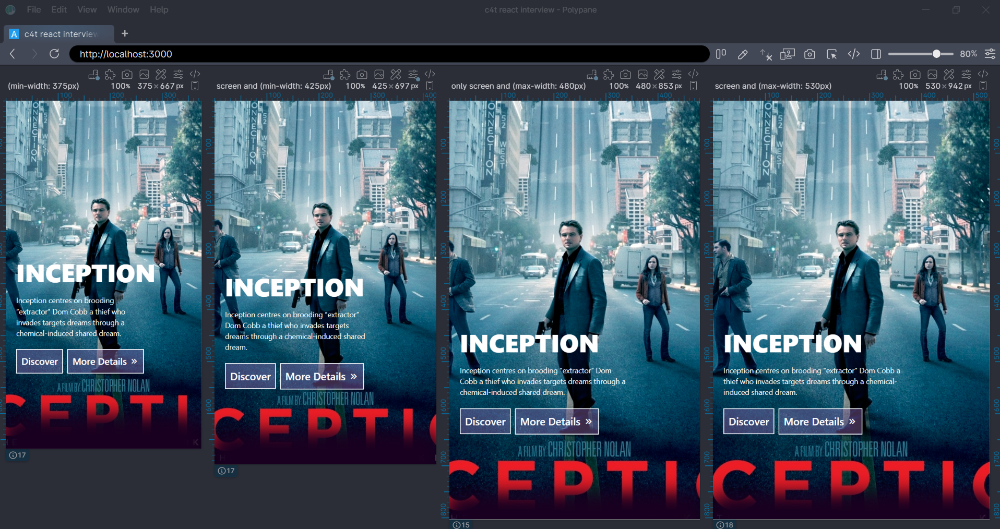
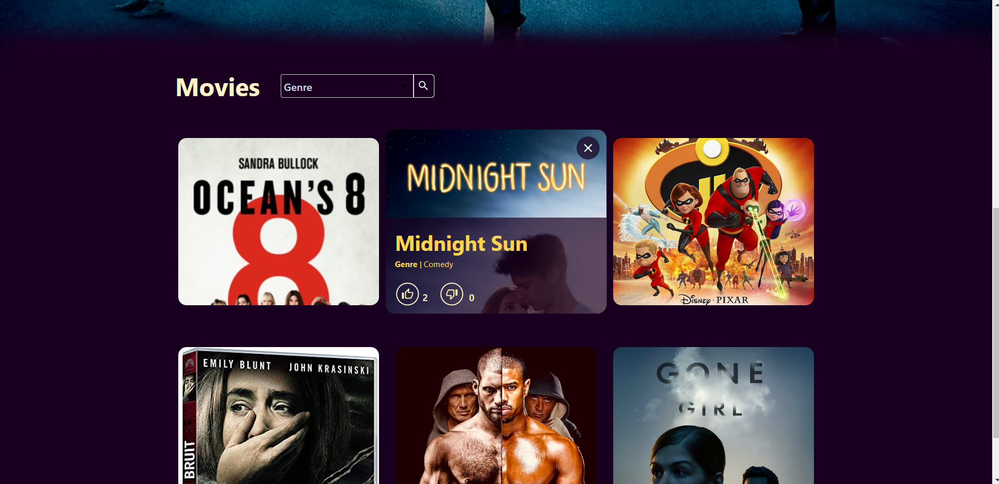
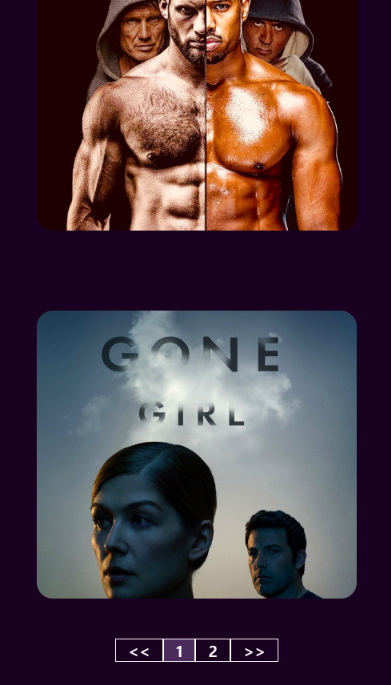
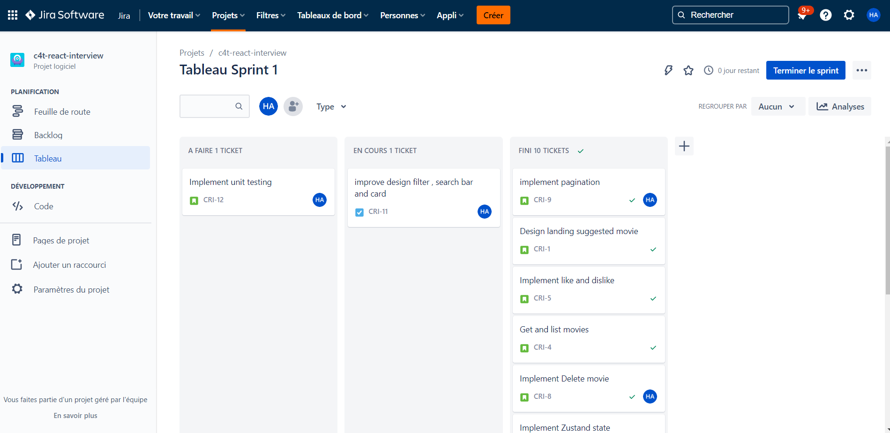

# c4t-react-interview

<p align="center"> <a >c4t-react-interview</a> Web Frontend with <a >Next JS</a> as a ReacJS framework  
    <p align="center">

</p>

## Setup

### Installation

```bash
$ npm install
```

### Running the app

```bash
# watch mode
$ npm run dev

# start 
$ npm run start
```

# Details

## Structure :

[//]: # (#### The backend consists of 3 Modules :)

##### - pages folder contains the views (for now we only have home)

##### - components (reusable) :

- coverMovie that accept a suggested movie could be reused in TV shows section in the future

- moviesList accepts a list of movies and title section (could be Popular or TV shows) : the filter and search are
  encapsulated in the component so it could be easily reused in different sections and data
- movie Card

##### - Types folder

##### - store for state management  :

- handling the state and the global function using Zustand, store folder contains movie.store.ts responsible for all
  actions needed for movies.

##### - test folder for jest

##### - cypress folder for e2e testing

## Responsive Design

Checking Responsiveness with Polypane on multiple screens

<p align="center">
  <a  target="blank"></a>
</p>

> **NOTE :**  The pictures must have a pattern (title position and ratio) in this case , I tried different background
> positions (center , top and bottom ..) and always some titles are missing.
>> unless you force it and lose picture resolution which is not an option.

<a  target="blank"></a>

- For mobile In the future could be displayed in a carousel for a better user experience :

<a  target="blank"></a>

## Jira

Managing work using Jira for team work in the future for tracking and reporting..


<p align="center">
  <a  target="blank"></a>
</p>

## Have a great weekend, I'm looking forward to meeting you !